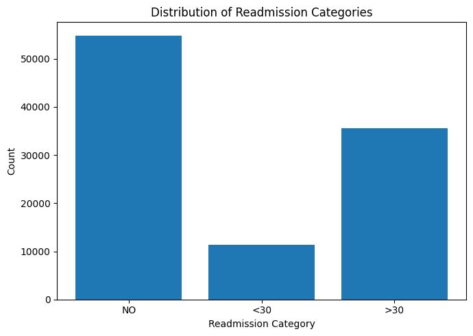
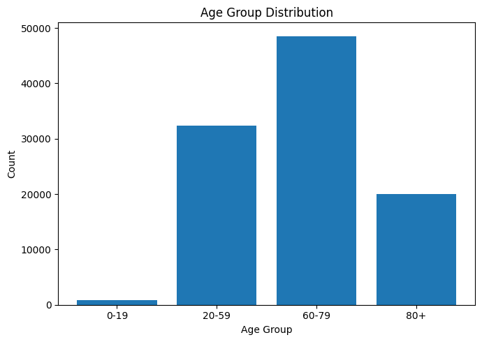
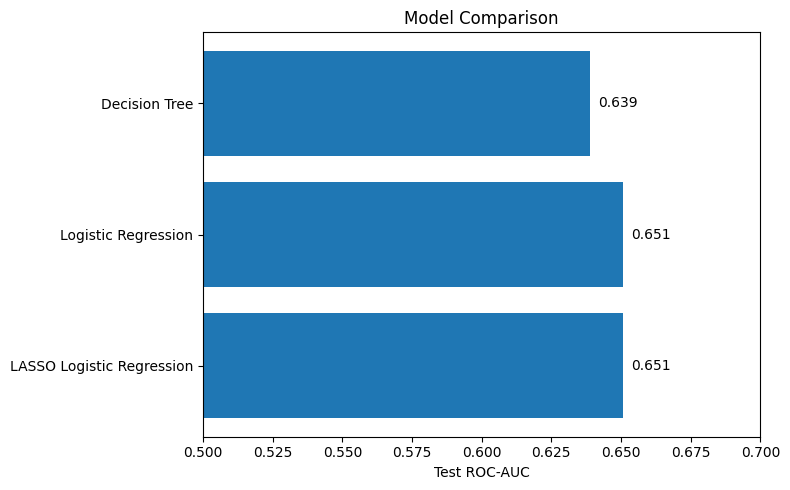
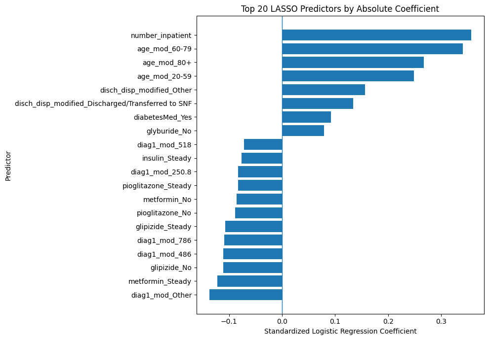
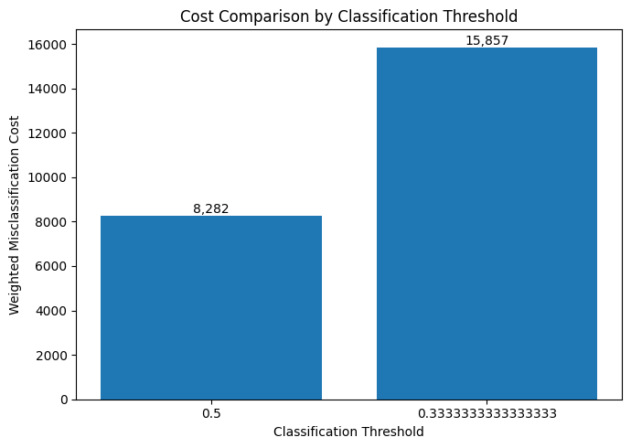

# Figures

This folder contains the main visualizations used to summarize the diabetes 30-day hospital readmission analysis.

## Files

### `readmission_distribution.png`

Shows the distribution of hospital readmission outcomes.

Approximately **11% of encounters resulted in a readmission within 30 days**, making the outcome highly imbalanced. This imbalance motivated the use of ROC-AUC for model comparison and additional threshold analysis. 

---

### `age_distribution.png`

Shows the distribution of patients across age groups.

Age was an important feature in the final analysis, with several age categories appearing among the strongest predictors in the LASSO logistic regression model. 

---

### `model_auc_comparison.png`

Compares test-set ROC-AUC across the three classification models:

- Logistic Regression
- LASSO Logistic Regression
- Decision Tree

LASSO achieved the highest test AUC, with logistic regression performing nearly identically and the decision tree performing slightly worse. 

---

### `lasso_top_predictors.png`

Displays the predictors with the largest absolute coefficients in the LASSO logistic regression model.

Important predictors included:

- Prior inpatient visits
- Patient age group
- Discharge disposition
- Diagnosis categories
- Medication-related variables

Prior inpatient utilization was among the strongest positive predictors of 30-day readmission risk. 

---

### `threshold_cost_comparison.png`

Compares weighted misclassification cost using two classification thresholds:

- **0.50** — standard classification threshold
- **0.33** — cost-sensitive threshold based on the assumption that a false negative is twice as costly as a false positive

Lowering the threshold substantially increased recall for true readmissions, but it also produced many additional false positives. In the validation data, the 0.50 threshold resulted in a lower total weighted cost than the 0.33 threshold.

---

## Interpretation

Together, these figures illustrate the main modeling workflow:

**class imbalance → model comparison → predictor interpretation → decision-threshold evaluation**

They highlight both predictive performance and the practical trade-offs involved in using a readmission-risk model in a healthcare setting.
